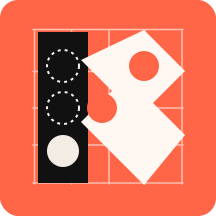

<div align="center">
  <h1>K-Steering</h1>
  <p>
    <a href="LICENSE"></a>
    <a href="https://discord.com/invite/kX6s6nV3zT"></a>
  </p>
  
</div>

K-Steering is a framework for steering language model behavior by intervening on hidden activations at inference time. It supports non-linear multi-attribute control and includes [Contrastive Activation Addition (CAA)](https://arxiv.org/abs/2312.06681) as a linear baseline for comparison.

The framework is based on the paper [Beyond Linear Steering: Unified Multi-Attribute Control for Language Models](https://arxiv.org/abs/2505.24535), which introduces Non-Linear K-Steering as a principled alternative to linear combinations of steering vectors for multi-attribute control.


_Figure 1. For an activation vector A, a steering loss penalizes higher logits from a classifier on A for undesired labels and rewards higher logits for desired labels. By backpropagating this loss through the classifier, we obtain the steered activations A' = A − α∇L._

## Documentation

Full documentation is available at [docs.withmartian.com/k-steering](https://docs.withmartian.com/k-steering).

## Quick Start

### Requirements

- Python 3.11 or later
- [uv](https://docs.astral.sh/uv/) package manager

### Installation

```bash
git clone https://github.com/withmartian/k-steering.git
cd k-steering
uv sync
```

### Usage

Run the included example to verify your setup:

```bash
uv run python examples/01_k_steer.py
```

Additional examples covering CAA steering, external datasets, and alpha sweeps are in the [examples/](examples/) directory.

### Sample Python Notebook

Try K-Steering without any local setup using this [Colab notebook](https://colab.research.google.com/drive/1cj3G_gKZ1OSOwwzxPRGjusazF3MFb-yl#scrollTo=Vbm8dXXtNCeV).

## License

MIT — see [LICENSE](LICENSE).
