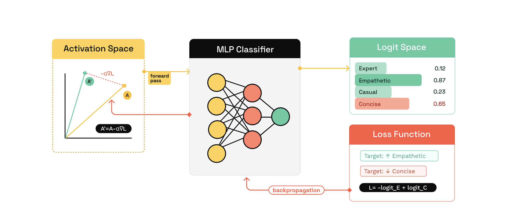

# K-Steering

## Table of Contents

- [Repository Overview](#repository-overview)
- [Introduction](#introduction)
- [Features](#✨-features)
- [Quick Start](#quick-start)
- [API Usage](#api-usage)
- [K-Steering Example](#k-steering-non-linear-steering)
- [CAA-Steering Example](#caa-steering)

## Repository Overview

Brief Overview of the Repository (Includes only major implementation details)

<details> 
<summary>Overview</summary>
    
    k_steering/
    ├── k_steering/
    │    ├── steering/
    │    │   ├── base.py             # Base Steering Class
    │    │   ├── k_steer.py          # K steering implementation
    │    │   └── trainer.py          # Steering Classifier Implementation
    │    │   └── caa.py              # CAA implementation
    │    │   └── dataset.py          # External dataset integration
    │    ├── evals/
    │    │   ├── judges/
    │    │   │     ├── base.py       # Base Judge class
    │    │   │     └── tone.py       # Tone Judge
    │    │   │     └── debate.py     # Debate Judge
    │    │   │     └── ood.py        # OOD judge (for Parameter Sweep)
    │    ├── data/
    │    ├── utils/
    └── README.md
    
</details>

<br>

## Introduction

K-Steering is a steering framework for training and applying non-linear control mechanisms to large language models (LLMs), enabling you to steer model behavior **towards desired target attributes** and **away from undesired behaviors.**

The framework is based on the paper [Beyond Linear Steering: Unified Multi-Attribute Control for Language Models](https://arxiv.org/abs/2505.24535), which introduces Non-Linear K-Steering as a principled alternative to linear combinations of steering vectors for multi-attribute control.


_Figure 1. An illustration of gradient-based K-Steering. For an activation vector A, we calculate a steering loss that
penalizes higher logits from a classifier on A for undesired labels and rewards higher logits for desired labels. By
backpropagating this loss through the classifier, we obtain the steered activations $A' = A − α∆L$_

In addition to K-Steering, the package also includes an implementation of [Contrastive Activation Addition (CAA)](https://arxiv.org/abs/2312.06681) for comparison and baseline steering experiments.

## ✨ Features

- **K-Steering–based multi-attribute control** with support for non-linear steering
- **Native Contrastive Activation Addition (CAA)** integration
- **Flexible, modular configuration** for steering behavior and classifier training
- **Predefined behavioral tasks** for rapid prototyping and experimentation
- **Automatic parameter sweeps** to find optimal steering coefficients via binary search
- **Seamless dataset integration**, supporting both Hugging Face and local datasets
- **Built for research and interpretability**, enabling controlled and analyzable generation workflows

## Quick Start

Get K-Steering running in minutes!!

### Try it in Google Colab

You can explore K-Steering without any local setup using the Colab notebook below.

[👉 K-Steering Colab Notebook](https://colab.research.google.com/drive/1cj3G_gKZ1OSOwwzxPRGjusazF3MFb-yl#scrollTo=Vbm8dXXtNCeV).

_(Includes installation, training, and inference examples)_

> The Colab notebook mirrors the examples below and is the recommended way to get started quickly.

### 📘 Documentation

For detailed explanations of the core concepts, terminology, and configuration arguments used throughout the package, see the [Documentation](/docs/README.md).

### Prerequisites

- **Python 3.12 or higher**
- **[uv](https://docs.astral.sh/uv/)** - Fast Python package installer and resolver

To install `uv`, follow the instructions at https://docs.astral.sh/uv/getting-started/installation/

### Installation

For now, we recommend running K-Steering locally from the root directory:

```bash
uv sync # for Environment Setup
```

This will create the environment and install all required dependencies.

## API Usage

See [Examples](/examples/) for Complete Scripts for Training Different Steering Models

## K-Steering (Non-Linear Steering)

This example shows how to use **K-Steering** to guide a language model’s behavior by training lightweight steering classifiers and applying them during inference.

---

### 1️⃣ Load Required Modules

```python
from k_steering.steering.config import SteeringConfig
from k_steering.steering.k_steer import KSteering
```

### 2️⃣ Select a Base Model

```python
# Hugging Face model to be steered
MODEL_NAME = "unsloth/Llama-3.2-1B-Instruct"
```

### 3️⃣ Configure Steering

Define which layers are used to train and apply steering.

```python
steering_config = SteeringConfig(
    train_layer=1,          # Layer used to train the steering classifier
    steer_layers=[1, 3],    # Layers where steering is applied
)
```

### 4️⃣ Task and Generation Settings

```python
TASK_NAME = "debates"       # e.g., "debates" or "tones"
MAX_NEW_TOKENS = 100        # Maximum number of tokens to generate
MAX_SAMPLES = 10            # Maximum number of samples for training

GENERATION_KWARGS = {
    "max_new_tokens": MAX_NEW_TOKENS,
    "temperature": 1.0,
    "top_p": 0.9,
}
```

### 5️⃣ Initialize K-Steering

Wrap the base model with K-Steering.

```python
steer_model = KSteering(
    model_name=MODEL_NAME,
    steering_config=steering_config,
)
```

### 6️⃣ Train Steering Classifiers

Train steering classifiers on task-specific data. Remove `max_samples` to use the full dataset.

```python
steer_model.fit(
    task=TASK_NAME,
    max_samples=MAX_SAMPLES,
)
```

### 7️⃣ Generate Steered Outputs

```python
prompts = [
    "Are political ideologies evolving in response to global challenges?"
]

output = steer_model.get_steered_output(
    prompts,
    target_labels=["Empirical Grounding"],     # Behaviors to encourage
    avoid_labels=["Straw Man Reframing"],      # Behaviors to suppress
    generation_kwargs=GENERATION_KWARGS,
)

print(output)
```

## CAA Steering

`k-steering` Package also includes an implementation of [Contrastive Activation Addition (CAA) paper](https://arxiv.org/abs/2312.06681) for linear steering baselines.

```python
from k_steering.steering.k_steer import CAASteering
from k_steering.steering.config import SteeringConfig

# Hugging Face model to be steered
MODEL_NAME = "unsloth/Llama-3.2-1B-Instruct"

# Define how and where steering classifiers are trained and applied
steering_config = SteeringConfig(
    train_layer=1,          # Layer index used to train the steering vectors
    pos = -1,               # Token Position used to extract hidden activations
    steer_layers=[1, 3],    # Layers where the steering will be applied
)

# Name of the task used to load training data
# (e.g., "debates" or "tones")
TASK_NAME = "debates"

# Maximum number of tokens to generate
MAX_NEW_TOKENS = 100

# Maximum number of samples for training
MAX_SAMPLES = 10

# Standard generation parameters passed to the model
GENERATION_KWARGS = {
    "max_new_tokens": MAX_NEW_TOKENS,
    "temperature": 1.0,
    "top_p": 0.9,
}

# Create a CAASteering wrapper around the base model
steer_model = CAASteering(
    model_name=MODEL_NAME,
    steering_config=steering_config,
)

# Train steering vectors on task-specific data. Remove `max_samples` to use the full dataset.
steer_model.fit(
    task=TASK_NAME,
    max_samples=MAX_SAMPLES,
)

# Input prompts
prompts = [
    "Are political ideologies evolving in response to global challenges?"
]

# Generate steered output by encouraging and discouraging specific labels
output = steer_model.get_steered_output(
    prompts,
    target_labels=['Empirical Grounding'],     # Labels to steer *towards*
    avoid_labels=['Straw Man Reframing'],    # Labels to steer *away from*
    generation_kwargs=GENERATION_KWARGS,
)

print(output)
```
